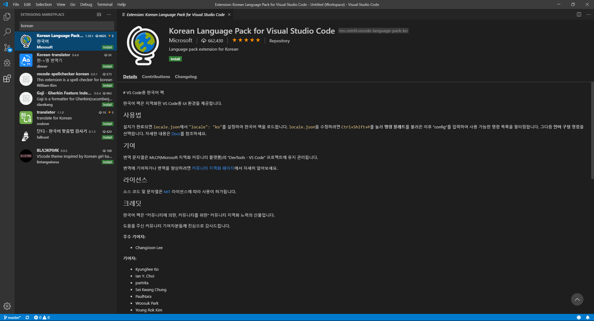
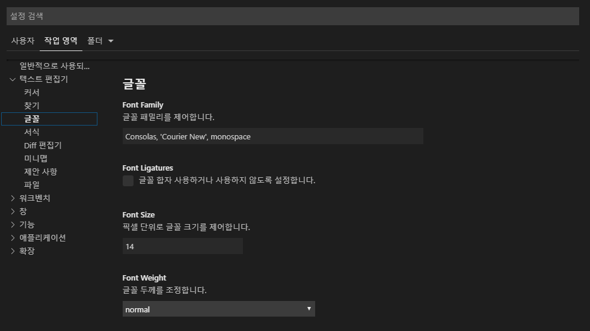

# 환경설정
개발을 위한 유용환 환경을 설정합니다.

## 언어팩 설치
VScode는 한국 개발자를 위한 한국어 환경을 제공합니다.

확장 검색창을 실행합니다. (ctrl+shift+x)를 선택합니다.
`korean`을 입력합니다.

섫치를 한후에는 vscode를 재시작 해주어야 합니다.

## 폰트

### 개발폰트 설치
한국어 환경에서 개발을 도와줄 수 있는 전용 폰트를 설치합니다.

한국어와 영문 글자의 폰트는 넓이가 동일 하지 하지 않습니다. 한영을 썩어서 개발을 할 때 동일 넓이의 개발 환경 글꼴을 설정할 수있습니다. 

네이버에서 무료로 제공하는 D2coding 폰트를 설치를 합니다.
https://github.com/naver/d2codingfont

다운로드할 파일을 선택합니다.
마우스 오른쪽키 클릭합니다. `다른이름으로 링크저장`을 클릭하여 zip파일을 다운로드 합니다.

폰트를 설치 합니다.
파일->기본설정->설정

택스트편집기->글꼴
d2coding 을 변경합니다.

### 폰트사이트
폰트 사이즈를 변경할 수 있습니다.
파일->기본설정->설정 으로 이동합니다.

텍스트 편집기 -> 글꼴을 선택합니다. font size를 기본값을 변경합니다.

