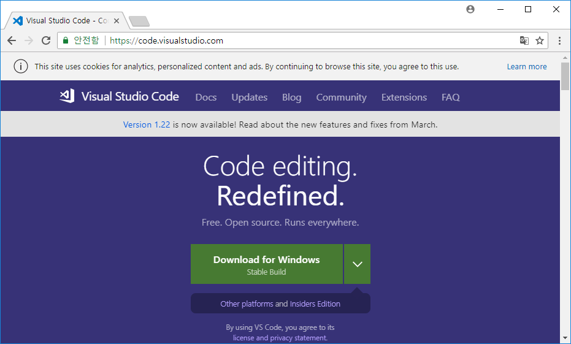
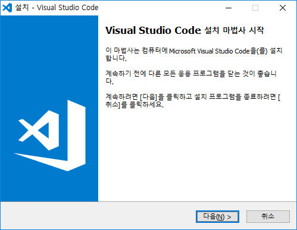
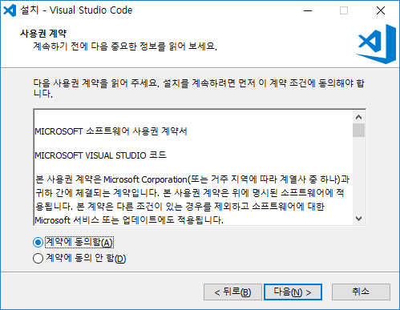
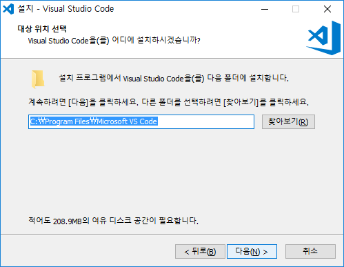
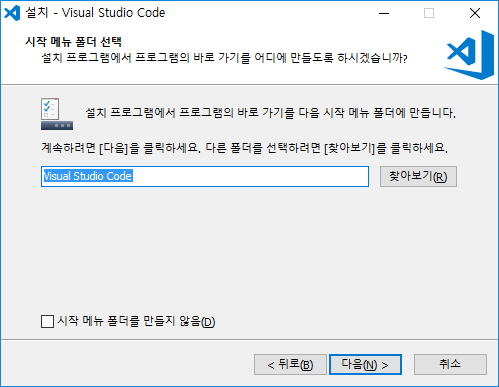
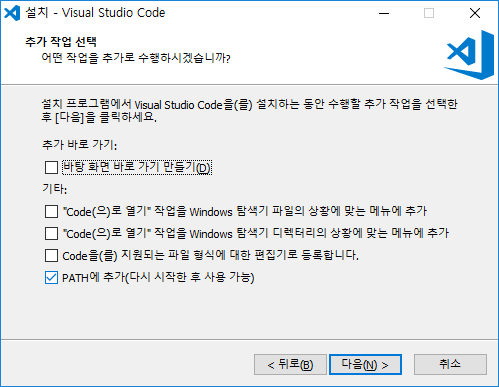
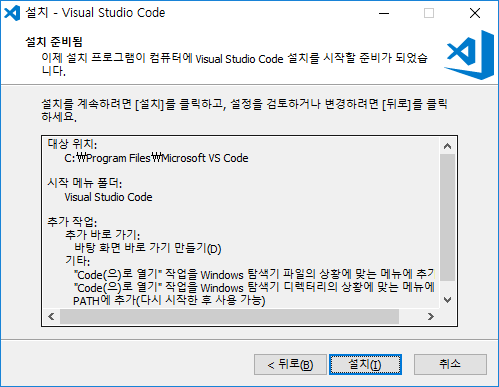
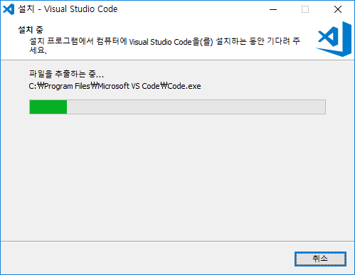
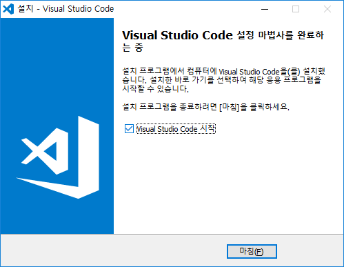
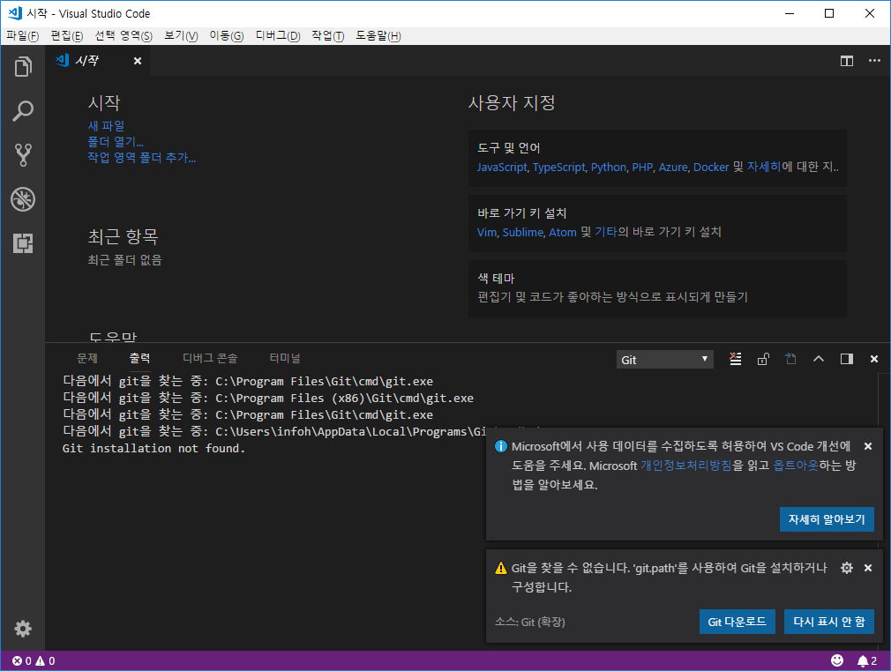

### VSCode
---
VSCode는 마이크로소프트에서 만들어 무료로 배포하는 텍스트 에디터 입니다. 최근들어 많은 개발자들로 부터 사랑을 받는 코드 에디터 입니다.
VSCode는 별도의 페키지들과 결합하여 코딩 작성시 유용한 기능들을 제공합니다.
 

### VSCode 설치
---
VSCode는 `code.visualstudio.com` 사이트에 접속을 하시면 무료로 다운로드 받을 수 있습니다.

사이트에 접속하면 시스템 환경에 맞는 설치 프로그램을 자동으로 선택제공 됩니다. 윈도우의 경우 자신의 시스템이 32bit용인지, 64bit용인지를 확인하여 설치하셔야 합니다. 맥 사용자를 위한 별도의 설치 프로그렘도 제공하고 있습니다.

다운로드 파일을 실행하면 다음과 같이 설치 마법사가 실행이 됩니다.

사용권 계약에 동의를 합니다.

VSCode를 설치할 디렉토리를 선택합니다. 보통 기본 상태에서 다음을 선택하면 됩니다.

다음을 선택합니다.

다음을 선택합니다.

다음을 선택합니다.

설치파일의 압축을 해제하여 시스템에 설치합니다. 컴퓨터의 사양에 따라 약간의 시간이 필요합니다.

설치가 완료된 화면을 보실 수 있습니다.

이제 VScode를 실행할 수 있습니다. 실행하면 다음과 같이 화면을 확인할 수 있습니다.

 