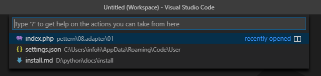

# 터미널

vscode는 터미널 작업을 쉽게 하기 위해서 터미널 창을 내장하고 있습니다.

단축키 `ctrl`+`` ` 를 입력하면 내부 터미널을 실행할 수 있습니다.


한개의 터미널을 사용하고 있는 도중에 새로운 터미널을 하나 더 추가하여 다중 터미널을 사용할 수 있습니다.

기존의 터미널이 실행되고 있는 과정에서 새로운 터미널을 실행할때에는 `ctrl`+`shift`+`` `을 입력합니다.


## 터미널 변경

vscode의 환경설정은 `settings.json`파일에 기록되어 관리 됩니다. 직접 환경 설정파일을 읽어서 편집할 수 있습니다. vscode에서 `ctrl+p`를  입력하여 검색창을 실행합니다.



최근에 입력했던 검색 기록들이 같이 출력이 됩니다. 입력창에서 `setting.json`을 입력합니다. 또는 `c:\Users\계정\AppData\Roaming\Code\User` 폴더에서 찾아 편집할 수 있습니다.

json파일을 수정하여 다음과 같이 항목을 하나 추가 합니다. 깃베쉬로 기본 터미널을 변경합니다.

```json
{
    "terminal.integrated.shell.windows": "C:\\Program Files\\Git\\bin\\bash.exe"
}
```

변경된 터미널로 실행을 하기 위해서는 파일을 vscode를 껏다가 다시 실행 합니다.


# VScode 터미널 변경

vscode 실행되는 터미널을 변경할 수 있습니다. 윈도우 10 기반에서 기본 설정 터미털은 파워쉘 입니다.


git bash로 변경을 해보도록 합니다.

## 설정실행

터미널을 변경하기 위해서는 먼저 설정을 실행합니다.

단축키  `ctrl` + `,`로 바로 설정 화면으로 전환이 가능합니다.


검색창에 `terminal.integrated.shell.windows`를 검색합니다


기본설정값이 파워셀로 되어 있습니다.

C:\Windows\System32\WindowsPowerShell\v1.0\powershell.exe


변경하고자 하는 터미널 프로그램으로 변경을 합니다.

C:\Program Files\Git\git-bash.exe


